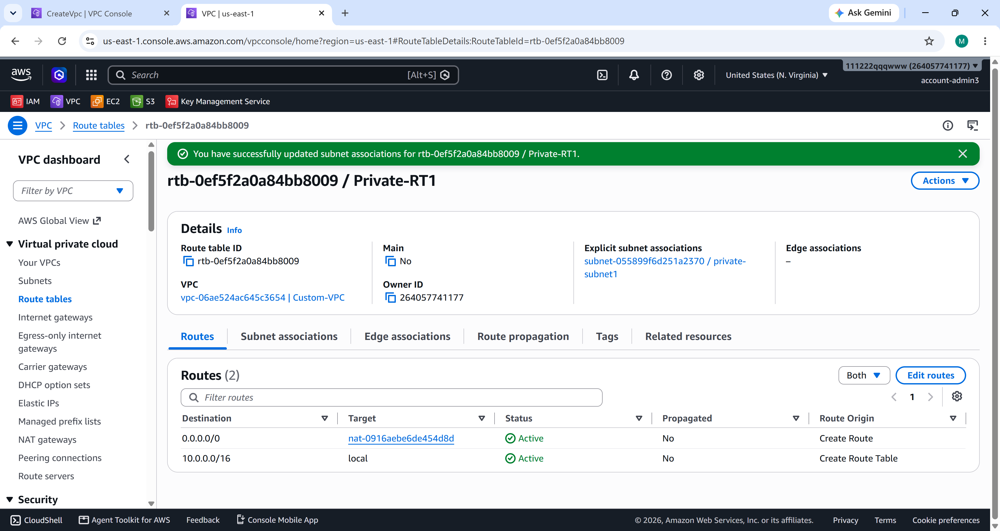

# 🏗️ AWS Custom VPC for a Multi-Tier Web Application
### AWS Core Services Introduction — Capstone Project 1

This project demonstrates the design and deployment of a *custom Virtual Private Cloud (VPC)* on AWS to host a *multi-tier web application*, using only the AWS Management Console.  
It's part of a hands-on capstone project to apply AWS core services.

---

## 🖼️ Architecture Diagram

---

## 📐 Architecture Overview

* **Custom VPC with CIDR block:** `10.0.0.0/16`
* **2 Public Subnets:** `10.0.10.0/24`, `10.0.20.0/24`
* **2 Private Subnets:** `10.0.100.0/24`, `10.0.200.0/24`
* **Internet Gateway (IGW)**
* **2 NAT Gateways:** Each in a public subnet with Elastic IP (EIP)
* **2 EC2 Instances:** (`Web_Server1`, `Web_Server2`) in Private Subnets
* **IAM Role (`ec2tossm`):** To allow SSM Session Manager access
* **Application Load Balancer (ALB):** Internet-facing
* **Target Group (`WebTG`):** With EC2 instances registered
* **Auto Scaling Group (ASG):** Configured with Launch Template
* **Security Groups:** `WebSG`, `ALBSG`

---

## 🧱 AWS Services Used

* **Amazon VPC** (Subnets, Route Tables, IGW, NAT Gateways)
* **Amazon EC2** (t2.micro, Amazon Linux 2023)
* **AWS Systems Manager (SSM)** (Session Manager for secure access without SSH)
* **Application Load Balancer (ALB)** & Target Groups
* **Auto Scaling Group (ASG)**
* **AWS Identity and Access Management (IAM)**

---

## 📸 Deployment Steps & Screenshots

Below are the main deployment steps with corresponding screenshots from the AWS Console.

### 1️⃣ VPC Creation
Custom VPC created with CIDR `10.0.0.0/16` and subnets CIDR ranges defined.

### 2️⃣ Private Route Tables
Private Route Tables configured for internal routing and NAT Gateway traffic.

### 3️⃣ IAM Role for Systems Manager (SSM)
IAM Role configured with necessary permissions to allow EC2 instances to communicate via SSM.

### 4️⃣ Web Server Instances Details
Instances deployed across the private subnets.

### 5️⃣ Web Servers Browser / Curl Tests
Verifying application response and network connectivity from both backend servers.

### 6️⃣ Security Groups Configuration
Security Group rules restricting access to backend instances and allowing public access to ALB.

### 7️⃣ Launch Template & Auto Scaling Group Creation
Launch Template configured and Auto Scaling Group initialized.

### 8️⃣ Auto Scaling Group Networking & Manual Scaling
Auto Scaling Group scaling configuration, networking setup, and activity history.

### 9️⃣ Target Group & Load Balancer Testing
Target Group health checks healthy and Application Load Balancer distributing HTTP requests.

---

## 🌍 Final Result

After the ALB and ASG setup, the application is served securely from private EC2 instances via the ALB. Scaling is automatic and traffic is balanced between instances.

---

## 🔐 Security Configuration Summary

| Security Group | Inbound Rules | Outbound Rules |
| :--- | :--- | :--- |
| **WebSG** | HTTP (80) from `ALBSG` | Allow all |
| **ALBSG** | HTTP (80) from `0.0.0.0/0` | HTTP (80) to `WebSG` |

---

## 🧹 Cleanup Steps

To avoid charges:
* Delete EC2 Instances and Auto Scaling Group.
* Delete NAT Gateways and release Elastic IPs.
* Delete ALB and Target Group.
* Delete Custom VPC.
*
